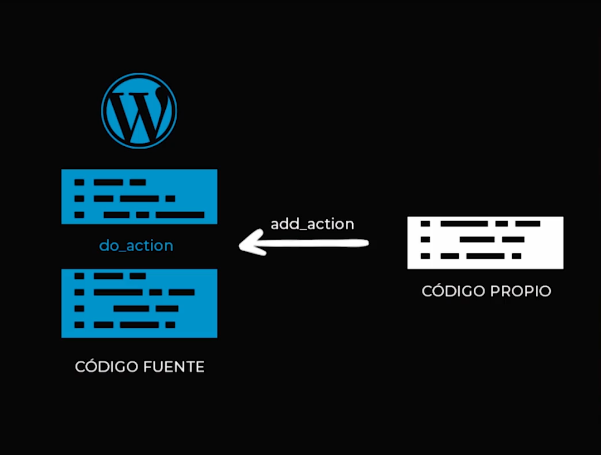
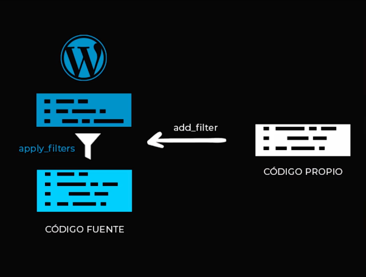

# Curso Practico Wordpress

# 1. ¿Qué es Wordpress?
Es un sístema de gestión **CMS** (Content Management System). Desarrollado en **PHP** y adaptado para el funcionar en entornos que utilizan los sistemas de gestión de bases de datos **MySQL**. El mismo opera bajo **Licencia GPL** y es un software libre.

## 1.1 Inicios
Wordpress fue creado en 2003 por el programador estadounidense **Matt Mullenweb** basándose en otra herramienta de software libre llamada **b2/cafelog**.

# 2. Funcionamiento y caracteristicas principales que tiene Wordpress.
## 2.1. Funcionamiento.
Wordpress funciona de la siguiente manera, cuando alguien entra en nuestro sitio, ejecuta el codigo fuente de wordpress, este consulta la base de datos y que contenidos tiene que devolver y los procesa con los temas o los templates, estos temas van a usar archivos para generar unas vistas a la par va a ejecutar los plugins los cuales van a servir como apoyo a los temas para ejecutar nuevas funcionalidades o agregar contenido en diferentes partes.

## 2.2. Caracteristicas.
1. Es autoadministrable: Permite administrar contenido y configuraciones sin usar código.
2. Gestión de usuários: Nos permite crear usuários con diferentes roles, los cuales nos permite devidir los permisos o poder gestionar los contenidos de cada uno.
3. API REST: Permite generar operaciones mediante API REST
4. Flexible: Permite personalizar tanto su diseño como sus funcionalidades.
5. Actualizaciones: Está en constante crecimiento.
6. Comunidad: Cuenta con una gran comunidad que aporta a su desarrollo.

# 3. ¿Qué son los temas(theme) en Wordpress?
## 3.1. Theme
Son la estructura de archivos la cual va a generar nuestras vistan en el navegador. Estos archivos toman la información de la base de datos MySQL y generan un código HTML que se envia al navegador. Para que wordpress identifique nuestro themplate listo para activar va a depender de que generemos dos archivos puntuales.
1. Va a ser el "index.php": este archivo es importante puesto que todas las vistas que nosotros generemos van a tomar por defecto nuestro archivo index.php.
2. El siguiente es el "style.css": Ademas de gestionar nuestro diseño, va a tomar toda la data puntual de nuestro themplate, por ejemplo el nombre del mismo, su creador hasta la URL de la licencia.

Otros archivos que vamos a utlizar son:
1. font-page.php: El cual va a cargar la vista por defecto de la paginca principal.
2. footer.php: va a cargar el footer de la pagina.
3. functions.php: Nos va a permitir poder generar nuestro propio código para ampliar las funcionalidades de worpress.
4. header.php: va a cargar el header.
5. 404.php : Va a ejecutar el codigo cuando alguien quiera entrar a una URL que no exista.
6. page.php: Pertenece a las paginas que generemos en la parte del administrador.
7. screenshop.png: imagen de referencia que vamos a tener al momento de elegir el template.
8. single.php: Esta vista va a corresponder al os post y entradas o a los post-type personalizados si no le especificamos una vista concreta.

Toda esta estructura de archivo son importantes porque es lo que va a dar dinamismo a la estructura de nuestro sitio, si nosotros no generamos todos estos archivos todos nuestro contenido se va a ver igual que nuestro archivo index.php.


# 4. ¿Qué son los Hooks en Wordpress?
Son lugares dentro del código fuentes de wordpress en los cuales podemos agregar código propio o modificar datos que el mismo nos provee.

## 4.1. Tipos de Hooks.
### 4.1.1. Actions.
Este actions nos permite agregar codigo o alguna funcionalidad personalizada, como por ejemplo imprimir algún mensaje en un punto especifico del código de wordpress.



Funciona con una funciones llamada "add_action" el cual va hacer referencia a un lugar del código fuente de wordpress que va a estar marcado por un "do_action" y la va a ejecutar justo en ese lugar

La forma de hacerlo es generando la funcion php (como en la imagen de abajo vemos un holaMundo) y la funcion add add_action que hace referencia a una dirección dentro del codigo wordpress, en este caso es wp_head que va hacer el encabezado, luego le pasamos otro argumento que va hacer el nombre de la función

```php
<?php 

functions holaMund(){
    echo "Hola Mundo";
}

add_actions('wp-head', 'holaMundo');

//add_actions($hook, $functions);

?>
```

### 4.1.2. Filter.
Nos permite ejecutar una función personalizada en un determinado punto, pero la función que usemos tendrá un parámetro de entrada, dentro de nuestra función haremos modificaciones al parámetro y finalmente lo retornaremos modificado.



La forma de hacerlo es generando una funcion php, en el siguiente ejemplo veemos como pasar un titulo a mayuscula, recivimos el $title dentro del filtro, el $title lo convertimos en mayúscula y lo retornamos, luego el add_filters() va a tomar el hooks como primer parametro (que va hacer la dirección en donde se va a ejecutar esa acción) y ademas le pasamos un string con el nombre la función

```php
<?php 

function upperTitle($title){
    return strtoupper($title);
}

add_filter('the_title', 'upperTitle');

// add_filter($hooks, $function)

?>
```

# 5. Manejo de librerías.
Las librerias en wordpress las podemos manejar de diferentes tipos para cada tipo de archivo vamos a user una función diferente 